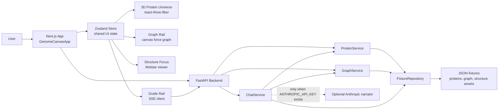

# GenomeCanvas

GenomeCanvas is a full-stack MVP for exploring proteins, diseases, drugs, trials, and structures as one synchronized workspace. The current app combines a 3D protein universe, a graph neighborhood drawer, an AlphaFold/Molstar structure focus view, and a grounded chat guide that can drive the UI through typed commands.

The project is intentionally fixture-backed right now. That makes the API and frontend contracts stable before a later move to live databases, graph stores, vector search, or external biomedical APIs.

## Table Of Contents

- [Motivation](#motivation)
- [What The App Does](#what-the-app-does)
- [Current Dataset](#current-dataset)
- [Repository Layout](#repository-layout)
- [End-To-End Architecture](#end-to-end-architecture)
- [Runtime Data Flow](#runtime-data-flow)
- [Backend Summary](#backend-summary)
- [Frontend Summary](#frontend-summary)
- [API Surface](#api-surface)
- [Chat And UI Command Protocol](#chat-and-ui-command-protocol)
- [Local Development](#local-development)
- [Environment Variables](#environment-variables)
- [Scripts](#scripts)
- [Testing](#testing)
- [Important Current Limitations](#important-current-limitations)
- [How To Extend The Project](#how-to-extend-the-project)

## Motivation

Biomedical data is naturally connected, but it is often explored in separate tools:

- protein catalog pages for identity and function
- disease association tables for biological relevance
- drug target databases for therapeutic context
- trial records for translational evidence
- 3D molecular viewers for structure inspection
- chat or search interfaces for guided reasoning

GenomeCanvas brings those views into one visual workspace. The goal is not just to search for a protein, but to keep the biological story visible while moving between scales:

- from a wide universe of proteins
- to a single protein spotlight
- to a graph neighborhood of diseases, drugs, and trials
- to a structure-level view
- to a guided explanation that can update the UI

The MVP focuses on a clear product question: can a user ask a biological question such as "What does BRCA1 do?", "Show me proteins involved in Alzheimer's disease", or "Find drugs targeting EGFR" and have the whole interface reframe around the answer?

## What The App Does

GenomeCanvas currently supports these user-facing capabilities:

1. Loads a 3D universe of proteins.
   - Each protein has a UMAP-like coordinate in 3D space.
   - Each protein is rendered as a ribbon trace rather than as a plain point.
   - Function categories color the universe.
   - The camera can move between wide, spotlight, and focus modes.

2. Lets users search proteins and graph entities from one palette.
   - Protein matches come from gene symbol, UniProt ID, protein name, function text, diseases, and drugs.
   - Graph matches come from node label, node ID, and node properties.
   - Search results can spotlight, dive into focus mode, filter the universe, or open graph context.

3. Shows graph neighborhoods.
   - The graph rail centers on a selected root node.
   - Nodes are grouped visually by type: protein, disease, drug, pathway, GO term, and trial.
   - Edges show relationships such as `ASSOCIATED_WITH`, `TARGETS`, `INTERACTS_WITH`, `INVESTIGATED_IN`, and `STUDIES`.

4. Opens a protein focus view.
   - The focus overlay shows protein metadata, diseases, drugs, nearby similar proteins, and structure confidence metrics.
   - If the fixture asset has a public AlphaFold PDB URL, the frontend loads the structure in Molstar.
   - If a public structure URL is unavailable, the UI keeps an approximate precomputed trace and explains the fallback.

5. Streams a grounded chat response.
   - The backend builds a deterministic response from local fixture data.
   - If `ANTHROPIC_API_KEY` is set, the backend can ask Anthropic to narrate the grounded response.
   - If no key is present, the chat still works offline using the local deterministic envelope.
   - Chat responses stream as server-sent events.
   - Chat can issue typed UI commands such as highlight, graph navigation, structure load, and viewport changes.

6. Supports three main demo flows in tests and fixture data.
   - BRCA1 explanation
   - Alzheimer disease exploration
   - EGFR drug-target exploration

This is not a clinical decision support tool. It is an exploratory visualization and interaction prototype over curated fixture data.

## Current Dataset

The backend data files live in `backend/app/data/`.

Current fixture counts:

| Asset | Count |
| --- | ---: |
| Proteins | 54 |
| Graph nodes | 187 |
| Graph edges | 217 |
| Structure assets | 54 |
| Distinct disease labels in proteins | 76 |
| Distinct drug labels in proteins | 42 |
| Distinct GO term IDs in proteins | 90 |

Protein function categories:

| Category | Count |
| --- | ---: |
| transporter | 11 |
| enzyme | 11 |
| structural | 11 |
| signaling | 11 |
| dna_repair | 10 |

Graph node types:

| Node type | Count |
| --- | ---: |
| disease | 76 |
| protein | 54 |
| drug | 42 |
| trial | 15 |

Graph edge labels:

| Edge label | Count |
| --- | ---: |
| `ASSOCIATED_WITH` | 118 |
| `TARGETS` | 47 |
| `INTERACTS_WITH` | 20 |
| `INVESTIGATED_IN` | 17 |
| `STUDIES` | 15 |

Structure asset sources:

| Source | Count |
| --- | ---: |
| AlphaFold-derived | 52 |
| Procedural fallback | 2 |

Representative proteins include:

- `BRCA1` (`P38398`) for DNA repair and breast cancer flows
- `EGFR` (`P00533`) for drug target exploration
- `APP` (`P05067`), `PSEN1` (`P49768`), `MAPT` (`P10636`), and `APOE` (`P02649`) for Alzheimer exploration
- `KRAS`, `BRAF`, `ERBB2`, `TP53`, `PTEN`, `AKT1`, `PARP1`, `CFTR`, `ABCB1`, `SLC6A4`, and other common biomedical examples

Representative drugs include `Olaparib`, `Osimertinib`, `Lecanemab`, `Trastuzumab`, `Imatinib`, `Dabrafenib`, `Ruxolitinib`, `Palbociclib`, and `Ivacaftor`.

Representative trials include `OlympiAD Trial`, `FLAURA Trial`, `SOLO-1 Trial`, `PALOMA-2 Trial`, `KEYNOTE-177 Trial`, and `COMFORT-II Trial`.

## Repository Layout

```text
.
|-- README.md
|-- .env.example
|-- package.json
|-- backend/
|   |-- README.md
|   |-- requirements.txt
|   |-- scripts/
|   |   `-- build_fixtures.py
|   |-- app/
|   |   |-- main.py
|   |   |-- dependencies.py
|   |   |-- core/
|   |   |-- data/
|   |   |-- models/
|   |   |-- repositories/
|   |   |-- routers/
|   |   `-- services/
|   `-- tests/
`-- frontend/
    |-- README.md
    |-- package.json
    |-- app/
    |-- components/
    |-- lib/
    |-- public/
    |-- scripts/
    |-- __tests__/
    `-- e2e/
```

For deeper layer-specific documentation:

- Backend: [backend/README.md](backend/README.md)
- Frontend: [frontend/README.md](frontend/README.md)

## End-To-End Architecture



The architecture is deliberately simple:

- The backend owns data normalization, search, graph traversal, similarity, chat grounding, and API schemas.
- The frontend owns rendering, interaction state, camera behavior, drawers, overlays, and chat command application.
- Shared contracts are mirrored in Python Pydantic models and TypeScript interfaces.
- The fixture repository is the current source of truth and can later be replaced with live repositories.

## Runtime Data Flow

### Initial page load

1. `frontend/app/page.tsx` renders `GenomeCanvasApp`.
2. `GenomeCanvasApp` calls `fetchUniverse()` and `fetchUniverseAssets()` in parallel.
3. The backend returns:
   - `/api/proteins/universe` for protein summaries
   - `/api/proteins/universe-assets` for lightweight low and mid traces
4. Zustand stores the protein summaries and trace assets.
5. `ProteinUniverse` renders each protein trace on a full-screen `@react-three/fiber` canvas.

### Search and spotlight

1. The user types in the palette.
2. The frontend calls:
   - `/api/proteins/search`
   - `/api/graph/search`
3. The palette merges protein and graph results.
4. Selecting a protein can:
   - spotlight the protein
   - open focus mode
   - filter the universe
   - open graph context
5. The store updates `selectedEntity`, `graphRootId`, `highlightedIds`, `cameraTarget`, and sometimes `focusedProteinId`.

### Graph rail

1. Opening graph context sets `rightRailSections.graph` and `graphRootId`.
2. `GenomeCanvasApp` calls `/api/graph/neighborhood/{node_id}` with the current hop budget.
3. `GraphWorkspace` seeds a deterministic type-stratified ring layout, pins the root, then hands the result to a `react-force-graph-2d` canvas simulation and refits once it settles.
4. Clicking graph nodes updates the same shared selection state used by the universe and chat.

### Structure focus

1. Focus mode calls:
   - `/api/proteins/{uniprot_id}`
   - `/api/proteins/{uniprot_id}/structure-asset`
   - `/api/proteins/{uniprot_id}/similar`
2. The focus overlay shows details, related diseases/drugs, nearby proteins, confidence metrics, and Molstar when available.
3. The structure asset includes:
   - low trace for universe rendering
   - mid trace for highlighted rendering
   - focus trace for detailed rendering/fallbacks
   - pLDDT confidence summary
   - AlphaFold PDB URL when available
   - procedural fallback source when needed

### Chat-driven exploration

1. The user submits a chat prompt.
2. The frontend sends the prompt plus UI context to `/api/chat/message`.
3. The backend resolves the biological intent using fixture data.
4. The backend emits SSE events:
   - `sources`
   - one or more `command` events
   - multiple `chunk` events
   - `done`
5. The frontend appends streamed text into the chat session.
6. The frontend applies each command to the shared store.
7. The stage, graph rail, and guide rail update from the same command-driven state.

## Backend Summary

The backend is a FastAPI app in `backend/app/`.

Primary responsibilities:

- load and normalize local fixture data
- expose typed API endpoints
- search proteins and graph nodes
- compute nearby proteins using 3D coordinate distance
- traverse graph neighborhoods and shortest paths
- stream chat responses as typed SSE events
- optionally pass grounded responses through Anthropic for narration

Important backend files:

| File | Purpose |
| --- | --- |
| `backend/app/main.py` | Creates the FastAPI app, CORS middleware, lifespan services, routers, and health route. |
| `backend/app/core/config.py` | Reads environment-backed settings and locates the data directory. |
| `backend/app/core/text.py` | Provides slugging, tokenization, overlap scoring, and chat text chunking. |
| `backend/app/models/schemas.py` | Defines every Pydantic API schema. |
| `backend/app/repositories/fixture_repository.py` | Loads fixture bundles and builds in-memory lookup maps and graph adjacency. |
| `backend/app/repositories/fixture_builder.py` | Canonicalizes proteins, diseases, drugs, trials, nodes, and edges. |
| `backend/app/repositories/structure_asset_builder.py` | Builds AlphaFold/procedural structure trace assets. |
| `backend/app/services/protein_service.py` | Protein universe, search, detail, similarity, disease matching, and structure asset access. |
| `backend/app/services/graph_service.py` | Graph search, neighborhood expansion, path finding, and generic graph query handling. |
| `backend/app/services/chat_service.py` | Intent resolution, grounded responses, sources, and UI command creation. |
| `backend/app/services/llm_service.py` | Optional Anthropic narrator with strict JSON output contract. |
| `backend/app/routers/*.py` | FastAPI route definitions for proteins, graph, and chat. |

Read the detailed backend documentation in [backend/README.md](backend/README.md).

## Frontend Summary

The frontend is a Next.js 14, React 18, TypeScript app in `frontend/`.

Primary responsibilities:

- render the immersive UI
- fetch typed backend data
- keep synchronized app state in Zustand
- render protein traces with Three.js and `@react-three/fiber`
- render graph neighborhoods as a seeded canvas force simulation
- load Molstar viewer assets for AlphaFold structures
- parse chat SSE streams
- apply backend chat commands to UI state

Important frontend files:

| File | Purpose |
| --- | --- |
| `frontend/app/page.tsx` | Renders `GenomeCanvasApp`. |
| `frontend/app/layout.tsx` | Defines metadata and global layout. |
| `frontend/app/globals.css` | Design tokens plus styles for the workspace shell, command bar, stage, and rail panels. |
| `frontend/components/GenomeCanvasApp.tsx` | Wires store slices and async hydration into workspace slots. |
| `frontend/components/WorkspaceShell.tsx` | Stateless layout: command bar, stage, and right rail as slots. |
| `frontend/components/CommandBar.tsx` | Controlled search bar with per-result action verbs and rail toggles. |
| `frontend/components/UniverseViewport.tsx` | Universe stage wrapper: camera toolbar and status row. |
| `frontend/components/ProteinUniverse.tsx` | Three.js protein universe, camera rig, and LOD ribbons. |
| `frontend/components/GraphWorkspace.tsx` | Canvas force-graph rail panel with hop control and node inspection. |
| `frontend/components/GuideWorkspace.tsx` | Chat rail panel: prompts, streamed response, action and source chips. |
| `frontend/components/StructureViewport.tsx` | Focus-mode layout: Molstar stage and protein detail sidebar. |
| `frontend/components/StructurePanel.tsx` | Thin adapter retained over `StructureViewport`. |
| `frontend/components/ChatPanel.tsx` | Thin re-export retained over `GuideWorkspace`. |
| `frontend/components/MolstarViewport.tsx` | Side-loads local Molstar assets and mounts the viewer. |
| `frontend/lib/api.ts` | Backend API client and SSE parser. |
| `frontend/lib/store.ts` | Zustand store and command application logic. |
| `frontend/lib/types.ts` | TypeScript contracts mirroring backend Pydantic schemas. |
| `frontend/lib/utils.ts` | Entity inference, colors, filtering, confidence colors, and 3D transforms. |
| `frontend/lib/viewport.ts` | Scene bounds and FOV-limited camera framing math. |

Read the detailed frontend documentation in [frontend/README.md](frontend/README.md).

## API Surface

The backend listens on `http://localhost:8000` by default.

### Health

| Method | Path | Purpose |
| --- | --- | --- |
| `GET` | `/api/health` | Reports service health plus loaded protein and graph node counts. |

### Proteins

| Method | Path | Purpose |
| --- | --- | --- |
| `GET` | `/api/proteins/universe` | Returns all proteins as lightweight universe summaries. |
| `GET` | `/api/proteins/universe-assets` | Returns low and mid structure traces for all proteins. |
| `GET` | `/api/proteins/search?q=&limit=` | Searches proteins and returns scored matches. |
| `GET` | `/api/proteins/{uniprot_id}` | Returns full protein detail. |
| `GET` | `/api/proteins/{uniprot_id}/similar?limit=` | Returns nearest proteins by 3D UMAP coordinate distance. |
| `GET` | `/api/proteins/{uniprot_id}/structure-asset` | Returns full structure asset, focus trace, camera hint, confidence summary, and similar IDs. |

### Graph

| Method | Path | Purpose |
| --- | --- | --- |
| `GET` | `/api/graph/neighborhood/{node_id}?hops=` | Returns a 1 or 2 hop neighborhood around a node. |
| `GET` | `/api/graph/search?q=&type=&limit=` | Searches graph nodes, optionally by node type. |
| `GET` | `/api/graph/path?from=&to=` | Finds a shortest graph path between two nodes. |
| `POST` | `/api/graph/query` | Generic graph query endpoint for entity, search, type, hops, and limit. |

### Chat

| Method | Path | Purpose |
| --- | --- | --- |
| `POST` | `/api/chat/message` | Streams a grounded chat response as `text/event-stream`. |

The generated OpenAPI schema is available from FastAPI at `/openapi.json` when the backend is running.

## Chat And UI Command Protocol

The chat route accepts:

```json
{
  "message": "Find drugs targeting EGFR",
  "context": {
    "selected_entity_id": null,
    "selected_protein_id": null,
    "graph_root_id": null,
    "universe_filter": null,
    "highlighted_ids": []
  }
}
```

The route streams server-sent events. The frontend parser in `frontend/lib/api.ts` expects event blocks separated by blank lines.

Event types:

| Event | Payload | Meaning |
| --- | --- | --- |
| `sources` | `ChatSource[]` | Source chips to attach to the assistant message. |
| `command` | `ChatCommand` | A UI command to apply immediately. |
| `chunk` | `{ "text": "..." }` | A piece of assistant text. |
| `done` | `{ "status": "ok" }` | Successful completion marker. |
| `error` | `{ "detail": "..." }` | Stream-level error marker. |

Supported command types:

| Command | Effect |
| --- | --- |
| `highlight` | Adds one or more IDs to the global highlight set. |
| `navigate` | Selects an entity, opens graph context, and updates camera target when applicable. |
| `filter_universe` | Sets the universe filter query and highlights matching proteins. |
| `load_structure` | Switches to focus mode and loads protein detail/structure assets. |
| `set_graph_root` | Centers the graph rail on a target ID. |
| `set_viewport` | Switches between `universe` and `focus` viewport modes. |

## Local Development

### Prerequisites

- Python 3.11 or newer is recommended.
- Node.js 18 or newer is recommended for Next.js 14.
- npm works with the scripts in this repo. The root package also contains a Yarn 1 package manager hint, but the checked-in frontend lockfile is `package-lock.json`.

### Install backend dependencies

```bash
cd backend
python3 -m venv .venv
source .venv/bin/activate
pip install -r requirements.txt
```

### Install frontend dependencies

```bash
cd frontend
npm install
```

The frontend `postinstall` script copies Molstar viewer assets from `node_modules/molstar/build/viewer` into `frontend/public/vendor/molstar-viewer`.

### Start the backend

From the repository root:

```bash
npm run dev:backend
```

Or directly:

```bash
cd backend
python3 -m uvicorn app.main:app --reload
```

Default URL: `http://localhost:8000`

### Start the frontend

From the repository root:

```bash
npm run dev:frontend
```

Or directly:

```bash
cd frontend
npm run dev
```

Default URL: `http://localhost:3000`

Open the app at `http://localhost:3000`.

## Environment Variables

Copy `.env.example` if you want local environment values:

```bash
cp .env.example .env
```

Variables:

| Variable | Default | Used by | Purpose |
| --- | --- | --- | --- |
| `NEXT_PUBLIC_API_BASE_URL` | `http://localhost:8000` | Frontend | Base URL for API requests. |
| `GENOMECANVAS_CORS_ORIGINS` | `http://localhost:3000,http://localhost:3001` | Backend | Comma-separated allowed CORS origins. |
| `ANTHROPIC_API_KEY` | empty | Backend | Enables optional LLM narration for chat. |
| `ANTHROPIC_MODEL` | `claude-sonnet-5` | Backend | Anthropic model name used by `LLMNarrator`. |

If `ANTHROPIC_API_KEY` is empty, chat remains functional and deterministic. It uses the local grounded response built by `ChatService`.

## Scripts

Root scripts from `package.json`:

| Command | Purpose |
| --- | --- |
| `npm run build:fixtures` | Rebuilds normalized fixture JSON and structure assets. |
| `npm run dev:backend` | Starts the FastAPI backend with reload. |
| `npm run dev:frontend` | Starts the Next.js frontend. |
| `npm run lint:frontend` | Runs the frontend lint script. |
| `npm run build:frontend` | Builds the frontend production bundle. |
| `npm run test:backend` | Runs backend `unittest` tests. |
| `npm run test:frontend` | Runs frontend Vitest tests. |
| `npm run test` | Runs backend tests and frontend tests. |

Frontend scripts from `frontend/package.json`:

| Command | Purpose |
| --- | --- |
| `npm run dev` | Starts Next.js dev server. |
| `npm run build` | Builds the frontend. |
| `npm run start` | Starts the built frontend. |
| `npm run lint` | Runs Next lint. |
| `npm run test` | Runs Vitest once. |
| `npm run test:watch` | Runs Vitest in watch mode. |
| `npm run postinstall` | Copies Molstar assets into `public/vendor`. |

## Testing

Backend tests:

```bash
npm run test:backend
```

Coverage areas:

- API health and typed routes
- protein search demo flows
- graph path and graph query routes
- chat SSE event stream
- structure asset endpoints
- fixture consistency
- protein similarity behavior
- Alzheimer fixture coverage
- adversarial entity resolution (`test_resolution.py`), where each case pins an input that previously returned a confidently wrong answer

Frontend unit/component tests:

```bash
npm run test:frontend
```

Coverage areas:

- SSE parsing in `streamChatMessage`
- Zustand command application, including paragraph reassembly from streamed chunk indices
- chat panel rendering and streamed assistant content
- camera bounds and FOV-fit math in `lib/viewport.ts`
- workspace shell slot composition
- graph workspace layout refit and node selection

Frontend Playwright tests:

```bash
cd frontend
npx playwright test
```

The Playwright config starts the frontend on `http://127.0.0.1:3005`. The current E2E tests exercise:

- BRCA1 explanation
- Alzheimer disease exploration
- EGFR drug-target exploration
- workspace shell layout
- graph and guide rail collapse

For the E2E chat flows to fully work against the real backend, run the backend separately on `http://localhost:8000` or set `NEXT_PUBLIC_API_BASE_URL` to a reachable backend.

Continuous integration runs everything above on every push: `.github/workflows/ci.yml` runs the backend suite, then frontend typecheck, lint, Vitest, and a production build, then Playwright behind both.

## Deployment

Configuration is in the repo. Neither target has been provisioned yet, so there is no live URL.

- **Frontend on Vercel.** `vercel.json` sets `frontend/` as the root directory. After the first deploy, set `NEXT_PUBLIC_API_BASE_URL` to the API's public origin.
- **API on Render or any container host.** `render.yaml` builds `backend/Dockerfile`, which runs as a non-root user and bakes the fixtures into the image, since the repository is read-only at runtime and there is no database or volume. Set `GENOMECANVAS_CORS_ORIGINS` to the deployed frontend origin.
- `ANTHROPIC_API_KEY` is optional in both environments. Without it, chat stays grounded and deterministic.

## Important Current Limitations

- The app uses local JSON fixtures, not live biomedical databases.
- Search is lexical and lightweight, not vector search.
- Similarity is based on 3D fixture coordinates, not sequence alignment or structural alignment.
- The graph is in memory, not Neo4j or another persistent graph store.
- Chat is grounded by local fixture logic; the optional LLM narrator is not allowed to invent facts according to its system prompt, but it is still best treated as explanatory text over fixture data.
- `GraphNodeType` includes `go_term` and `pathway`, but the current generated graph fixture contains disease, protein, drug, and trial nodes.
- Entity resolution in chat requires whole-term matches on gene symbols and accessions, and scores graph queries only on non-stopword tokens above a `0.34` floor. Both guards exist because plain substring matching resolved "describe" to gene `DES` and "show me the app" to an unrelated disease. Loosening either reintroduces confidently wrong answers; `backend/tests/test_resolution.py` pins the behavior.
- This project is not intended for medical diagnosis, treatment selection, or clinical decision-making.

## How To Extend The Project

### Add or update proteins

1. Edit `backend/app/data/proteins.json`.
2. Include stable `uniprot_id`, gene/name fields, coordinates, function category, disease references, drug references, GO terms, and AlphaFold API URL when available.
3. Run:

```bash
npm run build:fixtures
```

4. Run backend tests:

```bash
npm run test:backend
```

The fixture builder will:

- uppercase UniProt IDs
- canonicalize disease IDs like `disease:alzheimer_s_disease`
- canonicalize drug IDs like `drug:olaparib`
- register graph protein nodes
- create disease association edges
- create drug target edges
- merge curated extra Alzheimer records
- rebuild the graph and structure asset files

### Add graph relationships

1. Edit `backend/app/data/knowledge_graph.json`.
2. Use existing node IDs where possible.
3. Add edges with clear labels and properties.
4. Run `npm run build:fixtures`.
5. Run `npm run test:backend`.

The builder validates consistency indirectly through tests and repository loading.

### Add a new backend route

1. Add or extend Pydantic schemas in `backend/app/models/schemas.py`.
2. Add service logic in `backend/app/services/`.
3. Add a route in `backend/app/routers/`.
4. Include the router in `backend/app/main.py` if it is a new router.
5. Add backend tests in `backend/tests/`.
6. Mirror the contract in `frontend/lib/types.ts`.
7. Add an API helper in `frontend/lib/api.ts`.

### Add a new frontend panel or state transition

1. Add the view component under `frontend/components/`.
2. Add shared state to `frontend/lib/store.ts` only if multiple components need it.
3. Add typed data to `frontend/lib/types.ts` if it comes from the API.
4. Compose the panel in `GenomeCanvasApp`.
5. Add tests for any command or API behavior that changes shared state.

### Replace fixtures with live infrastructure

The clean replacement point is `FixtureRepository`.

A future live version could keep the same services and API routes while replacing repository methods with:

- protein records from a SQL database
- graph neighborhoods from Neo4j
- semantic search from pgvector or another vector index
- structure assets from a storage bucket
- external enrichment from UniProt, AlphaFold, OpenTargets, ClinicalTrials.gov, or ChEMBL

The frontend should not need major changes if the backend response schemas stay stable.
