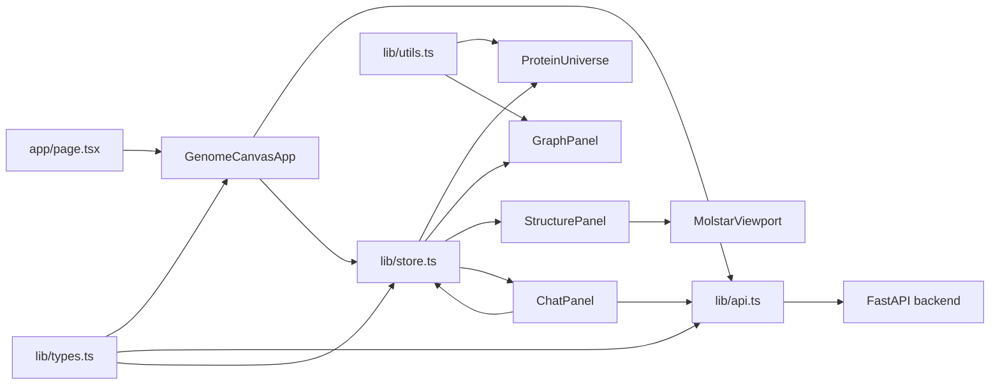

# GenomeCanvas Frontend

The frontend is a Next.js 14, React 18, and TypeScript app that renders the GenomeCanvas exploratory workspace. It turns backend protein, graph, structure, and chat contracts into an immersive UI with a full-screen 3D universe, search palette, graph drawer, structure focus overlay, and chat guide.

## Table Of Contents

- [Frontend Role](#frontend-role)
- [Directory Map](#directory-map)
- [Runtime Architecture](#runtime-architecture)
- [Main User Experience](#main-user-experience)
- [State Model](#state-model)
- [API Client](#api-client)
- [Component Details](#component-details)
- [3D Protein Universe](#3d-protein-universe)
- [Graph Drawer](#graph-drawer)
- [Structure Focus And Molstar](#structure-focus-and-molstar)
- [Chat Guide](#chat-guide)
- [Styling](#styling)
- [Scripts](#scripts)
- [Testing](#testing)
- [Running Locally](#running-locally)
- [Common Development Tasks](#common-development-tasks)
- [Current Limitations](#current-limitations)

## Frontend Role

The frontend owns the interactive experience. It does not normalize biomedical data itself. Instead, it consumes typed backend contracts and coordinates the views.

Its responsibilities are:

- fetch protein universe data
- fetch lightweight structure traces for all proteins
- search proteins and graph nodes
- keep shared UI state in Zustand
- render the 3D protein universe
- handle camera motion and protein selection
- render graph neighborhoods
- open structure focus mode
- load Molstar viewer assets for AlphaFold PDB URLs
- stream chat events from the backend
- apply backend chat commands to the UI
- provide unit, component, and E2E coverage for the main demo flows

## Directory Map

```text
frontend/
|-- README.md
|-- package.json
|-- package-lock.json
|-- next.config.mjs
|-- tsconfig.json
|-- vitest.config.ts
|-- playwright.config.ts
|-- test.setup.ts
|-- app/
|   |-- layout.tsx
|   |-- page.tsx
|   `-- globals.css
|-- components/
|   |-- GenomeCanvasApp.tsx
|   |-- ProteinUniverse.tsx
|   |-- GraphPanel.tsx
|   |-- StructurePanel.tsx
|   |-- MolstarViewport.tsx
|   `-- ChatPanel.tsx
|-- lib/
|   |-- api.ts
|   |-- store.ts
|   |-- types.ts
|   `-- utils.ts
|-- public/
|   `-- molstar-viewer.html
|-- scripts/
|   |-- copy-molstar-assets.mjs
|   `-- fetch-backbones.mjs
|-- __tests__/
|   |-- api.test.ts
|   |-- chat-panel.test.tsx
|   `-- store.test.ts
`-- e2e/
    `-- genomecanvas.spec.ts
```

## Runtime Architecture



The core design is:

- `GenomeCanvasApp` orchestrates data loading and high-level interactions.
- `lib/api.ts` knows how to call the backend and parse SSE streams.
- `lib/store.ts` stores shared UI state and applies chat commands.
- `lib/types.ts` mirrors backend schema shapes.
- Components render from props and store state.

## Main User Experience

The first screen is the actual app, not a landing page.

When the app loads:

1. A full-screen protein universe appears.
2. The header HUD shows the app title, search palette, graph button, and guide button.
3. Starter prompts appear when the guide has not been opened:
   - `What does BRCA1 do?`
   - `Show me proteins involved in Alzheimer's disease`
   - `Find drugs targeting EGFR`
4. Hovering a protein shows a small summary.
5. Clicking a protein spotlights it.
6. Double-clicking a protein opens focus mode.
7. The search palette can find proteins, diseases, drugs, and other graph entities.
8. The graph drawer shows the selected entity's neighborhood.
9. The guide can narrate and issue commands that reframe the canvas.

## State Model

State lives in `frontend/lib/store.ts` using Zustand.

### Stored data

| State key | Meaning |
| --- | --- |
| `universe` | Protein summaries returned by `/api/proteins/universe`. |
| `universeAssets` | Map of UniProt ID to lightweight trace assets. |
| `structureAssets` | Map of UniProt ID to full focus structure assets. |
| `searchResults` | Latest protein search results. |
| `graphResults` | Latest graph search results. |
| `graphData` | Currently loaded graph neighborhood. |
| `proteinDetails` | Cache of full protein detail records. |
| `chatSession` | User and assistant chat messages. |

### Interaction state

| State key | Meaning |
| --- | --- |
| `selectedEntity` | Active protein, disease, drug, trial, GO term, or pathway. |
| `experienceMode` | Either `universe` or `focus`. |
| `focusedProteinId` | Protein currently shown in focus mode. |
| `hoveredEntityId` | Entity currently hovered in the universe. |
| `highlightedIds` | IDs that should be visually highlighted. |
| `graphRootId` | Entity ID used as graph neighborhood root. |
| `universeFilter` | Text filter applied to the universe. |
| `graphOpen` | Whether graph drawer is open. |
| `guideOpen` | Whether chat guide is open. |
| `paletteOpen` | Whether search results are open. |
| `cameraTarget` | Camera target ID and mode. |
| `loading` | Loading flags for universe, graph, chat, and structure. |

### Important state actions

| Action | Purpose |
| --- | --- |
| `setUniverse` | Store protein summaries. |
| `upsertUniverseAssets` | Store many lightweight structure assets. |
| `upsertStructureAsset` | Cache one full structure asset. |
| `upsertProteinDetail` | Cache one protein detail record. |
| `spotlightEntity` | Select an entity, open graph, highlight as needed, and move camera. |
| `focusProtein` | Select a protein, switch to focus mode, open graph, and move camera close. |
| `leaveFocus` | Return from focus mode to universe mode. |
| `appendMessage` | Add a user or assistant chat message. |
| `appendAssistantChunk` | Append streamed text to an assistant message. |
| `attachSources` | Attach source chips to a chat message. |
| `appendCommand` | Attach a command chip to a chat message. |
| `finalizeMessage` | Mark an assistant message complete. |
| `applyCommand` | Convert backend chat commands into UI state updates. |
| `resetChat` | Clear chat and close guide. |
| `resetExperience` | Clear most interactive state and return to wide universe mode. |

### Command application

`applyCommand` handles backend chat commands:

| Command | Frontend state effect |
| --- | --- |
| `highlight` | Adds `target_id` and `target_ids` into `highlightedIds`. |
| `filter_universe` | Sets `universeFilter` and closes the palette. |
| `navigate` | Sets graph root, selected entity, graph open state, and camera target. |
| `set_graph_root` | Same navigation behavior for graph centering. |
| `load_structure` | Switches to focus mode for a protein and opens graph context. |
| `set_viewport` | Switches viewport mode and resets focus state when returning to universe. |

## API Client

`frontend/lib/api.ts` contains all backend calls.

`API_BASE_URL` comes from `NEXT_PUBLIC_API_BASE_URL` and defaults to `http://localhost:8000`.

REST helpers:

| Function | Backend route |
| --- | --- |
| `fetchUniverse()` | `GET /api/proteins/universe` |
| `fetchUniverseAssets()` | `GET /api/proteins/universe-assets` |
| `searchProteins(query, limit)` | `GET /api/proteins/search?q=&limit=` |
| `fetchProteinDetail(uniprotId)` | `GET /api/proteins/{uniprot_id}` |
| `fetchStructureAsset(uniprotId)` | `GET /api/proteins/{uniprot_id}/structure-asset` |
| `fetchSimilarProteins(uniprotId, limit)` | `GET /api/proteins/{uniprot_id}/similar?limit=` |
| `fetchNeighborhood(nodeId, hops)` | `GET /api/graph/neighborhood/{node_id}?hops=` |
| `searchGraph(query, type)` | `GET /api/graph/search?q=&type=` |
| `fetchPath(fromId, toId)` | `GET /api/graph/path?from=&to=` |

Chat helper:

| Function | Backend route |
| --- | --- |
| `streamChatMessage(payload, handlers)` | `POST /api/chat/message` |

The API client uses `cache: "no-store"` for JSON requests so the UI always reflects the current backend fixture state during development.

## Component Details

### `GenomeCanvasApp.tsx`

This is the main application orchestrator.

It:

- reads many values and actions from the Zustand store
- bootstraps the universe and universe assets
- searches proteins and graph nodes as the palette query changes
- hydrates protein details only when needed
- hydrates full structure assets only when needed
- loads graph neighborhoods when the graph drawer opens
- loads similar proteins when focus mode changes
- manages Escape key behavior
- composes the universe, HUD, palette, graph drawer, chat panel, and structure focus overlay

Key local helpers:

- `hydrateProtein(uniprotId)`
- `hydrateStructureAsset(uniprotId)`
- `highlightFilter(query)`
- `spotlightProtein(uniprotId)`
- `openGraphContext(id, type)`
- `focusProtein(uniprotId)`
- `handleCommand(command)`

### `ProteinUniverse.tsx`

Renders the full-screen 3D canvas.

It uses:

- `Canvas` from `@react-three/fiber`
- `Line`, `OrbitControls`, `Sparkles`, and `Stars` from `@react-three/drei`
- `Color`, `Group`, and `Vector3` from Three.js

Main internal pieces:

- `CameraRig`
- `ClusterMist`
- `ProteinRibbon`

### `GraphPanel.tsx`

Renders the graph drawer.

It:

- builds a radial SVG layout locally
- places the root node at the center
- groups other nodes by type-specific rings
- draws edges between nodes
- labels active or highlighted nodes
- exposes click handlers to select nodes

### `StructurePanel.tsx`

Renders focus mode for one protein.

It shows:

- gene symbol
- protein name
- function category
- sequence length
- organism
- function description
- diseases
- drugs
- nearby similar proteins
- confidence palette metrics
- structure source
- Molstar viewer or fallback copy

### `MolstarViewport.tsx`

Loads and mounts Molstar.

It:

- injects `/vendor/molstar-viewer/molstar.css`
- injects `/vendor/molstar-viewer/molstar.js`
- caches the loading promise on `window.__molstarLoaderPromise`
- creates `window.molstar.Viewer`
- disables large Molstar panels for an embedded focus view
- detects PDB, CIF, and BCIF formats from URL suffix
- clears the plugin on unmount when possible

### `ChatPanel.tsx`

Renders the guide drawer and chat session.

It:

- computes chat context from selected entity, selected protein, graph root, universe filter, and highlights
- sends user prompts to the backend SSE route
- appends streamed assistant chunks
- attaches source chips
- attaches command chips
- calls `onCommand` for every streamed backend command
- supports queued starter prompts from `GenomeCanvasApp`

Starter prompts live in the exported `STARTER_PROMPTS` array.

## 3D Protein Universe

The universe is not a point cloud. Each protein is drawn as a compact ribbon trace.

### Coordinate mapping

`proteinPosition()` in `frontend/lib/utils.ts` converts fixture coordinates:

```text
x = umap_x * 2.25
y = umap_y * 2.25 * 0.82
z = umap_z * 2.25 * 1.2
```

This spreads the fixture coordinates into a visually usable 3D space.

### Scale mapping

`proteinScale(boundsRadius)` returns:

```text
max(0.55, min(1.38, 0.48 + sqrt(boundsRadius) / 12))
```

This avoids tiny proteins becoming invisible and large proteins dominating the universe.

### Trace choice

`ProteinRibbon` chooses:

- `mid_trace` when selected, hovered, highlighted, or focused
- `low_trace` otherwise

This keeps the full universe cheaper to render while increasing detail for active proteins.

### Visual states

Opacity and line width change based on:

- selected
- hovered
- highlighted
- focused
- dimmed by filter
- current experience mode

Click behavior:

- single click spotlights a protein
- double click dives into focus mode

### Camera behavior

`CameraRig` uses frame-by-frame interpolation:

- wide mode positions the camera at `[0, 6, 34]`
- spotlight mode moves near the selected protein
- focus mode moves much closer to the selected protein
- OrbitControls keep the camera target synchronized

## Graph Drawer

The graph drawer is an SVG view, not `react-force-graph-2d` at runtime.

`GraphPanel` creates a deterministic radial layout:

- root node at `(360, 360)`
- other nodes grouped by type
- each type has a ring radius
- nodes are sorted by type order and label
- highlighted and selected nodes get larger radii
- labels are shown for active story points

Type ring radii:

| Type | Radius |
| --- | ---: |
| `protein` | 108 |
| `disease` | 152 |
| `drug` | 196 |
| `pathway` | 240 |
| `go_term` | 282 |
| `trial` | 324 |

Node colors come from `NODE_COLORS` in `frontend/lib/utils.ts`.

## Structure Focus And Molstar

Focus mode opens when:

- the user double-clicks a protein
- the user clicks `Dive` in the palette
- chat emits a `load_structure` command
- the user chooses a nearby structure from the focus sidebar

The app fetches:

- full protein detail
- full structure asset
- similar proteins

If `structureAsset.alphafold_pdb_url` exists, `StructurePanel` mounts `MolstarViewport`.

If no PDB URL exists, it shows fallback copy and relies on the precomputed trace in the universe/focus state. This is why structure assets include `structure_source`.

### Molstar assets

Molstar viewer assets are copied by:

```bash
npm run postinstall
```

The script is `frontend/scripts/copy-molstar-assets.mjs`.

It finds Molstar under either:

- `frontend/node_modules/molstar/build/viewer`
- root `node_modules/molstar/build/viewer`

Then it copies assets into:

```text
frontend/public/vendor/molstar-viewer
```

`MolstarViewport` expects:

- `/vendor/molstar-viewer/molstar.css`
- `/vendor/molstar-viewer/molstar.js`

There is also a standalone helper page at `frontend/public/molstar-viewer.html` that can load a structure URL through query parameters.

## Chat Guide

The chat guide uses server-sent events rather than waiting for one JSON response.

### Context sent to backend

`ChatPanel` sends:

```json
{
  "selected_entity_id": "P38398",
  "selected_protein_id": "P38398",
  "graph_root_id": "P38398",
  "universe_filter": null,
  "highlighted_ids": ["P38398"]
}
```

Actual values may be null or empty depending on current UI state.

### SSE parsing

`streamChatMessage()`:

1. posts JSON to `/api/chat/message`
2. gets a readable stream
3. decodes chunks with `TextDecoder`
4. buffers text until it sees `\n\n`
5. parses `event:` and `data:` lines
6. dispatches parsed JSON to handlers

Handlers:

- `onSources`
- `onCommand`
- `onChunk`
- `onDone`
- `onError`

The chat panel stores streamed text and command/source chips in `chatSession`.

## Styling

Global styling lives in `frontend/app/globals.css`.

Major styled regions:

- full-screen immersive page and scene shell
- universe canvas
- HUD brand and actions
- search palette and result rows
- floating starter prompts
- hover summary
- ambient status strip
- graph drawer
- chat guide deck
- structure focus overlay
- Molstar focus viewer shell
- responsive behavior for medium and mobile widths

The UI uses CSS custom properties for background, panel, line, text, accent, and shadow colors.

Important behavior:

- `body` is hidden overflow on desktop to keep the canvas immersive.
- mobile media queries allow page scrolling.
- drawers and overlays are absolute-positioned over the canvas.
- Molstar panels are hidden with `.msp-plugin` overrides to keep the embedded viewer focused.

## Scripts

From `frontend/package.json`:

| Command | Purpose |
| --- | --- |
| `npm run dev` | Starts the Next.js dev server. |
| `npm run build` | Builds the production Next.js app. |
| `npm run start` | Starts the built app. |
| `npm run lint` | Runs Next lint. |
| `npm run test` | Runs Vitest once. |
| `npm run test:watch` | Runs Vitest in watch mode. |
| `npm run postinstall` | Copies Molstar viewer assets into `public/vendor`. |

## Testing

### Vitest

Run:

```bash
npm run test
```

Config:

- `vitest.config.ts`
- React plugin from `@vitejs/plugin-react`
- `jsdom` environment
- alias `@` to the frontend directory
- setup file `test.setup.ts`

`test.setup.ts`:

- imports `@testing-library/jest-dom`
- mocks `scrollIntoView`

Unit/component tests:

| Test file | Covers |
| --- | --- |
| `__tests__/api.test.ts` | SSE parsing for sources, commands, chunks, and done events. |
| `__tests__/store.test.ts` | Command application across shared UI state. |
| `__tests__/chat-panel.test.tsx` | Prompt submission and streamed assistant rendering. |

### Playwright

Run:

```bash
npx playwright test
```

Config:

- `playwright.config.ts`
- test directory `e2e`
- base URL `http://127.0.0.1:3005`
- web server command `npm run dev -- --port 3005`
- trace on first retry

E2E tests:

- BRCA1 explanation flow
- Alzheimer disease exploration flow
- EGFR drug-target exploration flow

For E2E tests that call the real backend, keep the FastAPI backend running at the URL configured by `NEXT_PUBLIC_API_BASE_URL`.

## Running Locally

Install dependencies:

```bash
cd frontend
npm install
```

Start the frontend:

```bash
npm run dev
```

Default URL:

```text
http://localhost:3000
```

The backend should also be running:

```bash
cd ../backend
python3 -m uvicorn app.main:app --reload
```

Default backend URL:

```text
http://localhost:8000
```

If the backend runs somewhere else, set:

```bash
NEXT_PUBLIC_API_BASE_URL=http://localhost:8000
```

## Common Development Tasks

### Add a new API call

1. Add or update the TypeScript response type in `frontend/lib/types.ts`.
2. Add a helper in `frontend/lib/api.ts`.
3. Use the helper in `GenomeCanvasApp` or a component.
4. Cache data in Zustand if multiple components need it.
5. Add tests if parsing or state behavior is non-trivial.

### Add a new chat command

1. Add the command type to `ChatCommandType` in `frontend/lib/types.ts`.
2. Implement behavior in `applyCommand` in `frontend/lib/store.ts`.
3. If the command needs data hydration, update `handleCommand` in `GenomeCanvasApp`.
4. Add a store test.
5. Make sure the backend schema and chat service emit the same command shape.

### Add a new graph node type

1. Add the type to backend `GraphNodeType`.
2. Mirror it in frontend `GraphNodeType`.
3. Add a color in `NODE_COLORS`.
4. Add a ring radius in `TYPE_RING_RADIUS`.
5. Add it to `TYPE_ORDER`.
6. Confirm graph search and graph neighborhood responses include the type.

### Change protein rendering

Relevant files:

- `frontend/components/ProteinUniverse.tsx`
- `frontend/lib/utils.ts`
- `backend/app/repositories/structure_asset_builder.py`

Most visual behavior depends on:

- `proteinPosition`
- `proteinScale`
- trace point counts
- confidence colors
- function category halo colors
- selected/hovered/highlighted/focused state

### Change focus mode

Relevant files:

- `frontend/components/StructurePanel.tsx`
- `frontend/components/MolstarViewport.tsx`
- `frontend/components/GenomeCanvasApp.tsx`
- `frontend/lib/store.ts`

Focus mode requires:

- `focusedProteinId`
- cached `ProteinDetail`
- cached `ProteinStructureAsset`
- similar protein results

### Change search behavior

Search scoring is backend-owned. Update:

- `backend/app/services/protein_service.py`
- `backend/app/services/graph_service.py`

Frontend palette behavior is in:

- `GenomeCanvasApp.tsx`

## Current Limitations

- The frontend depends on the backend being available for live data.
- It does not persist UI state across reloads.
- It does not use route-level navigation for selected proteins or graph nodes.
- The graph drawer uses a deterministic SVG radial layout, not a physics simulation.
- `react-force-graph-2d` is listed as a dependency, but the active graph UI is SVG-based.
- `frontend/scripts/fetch-backbones.mjs` is not part of the current runtime data path.
- The Molstar vendor assets must exist under `public/vendor/molstar-viewer`; run `npm install` or `npm run postinstall` if the viewer script is missing.
- This UI is an exploratory prototype over fixture data, not a clinical tool.
